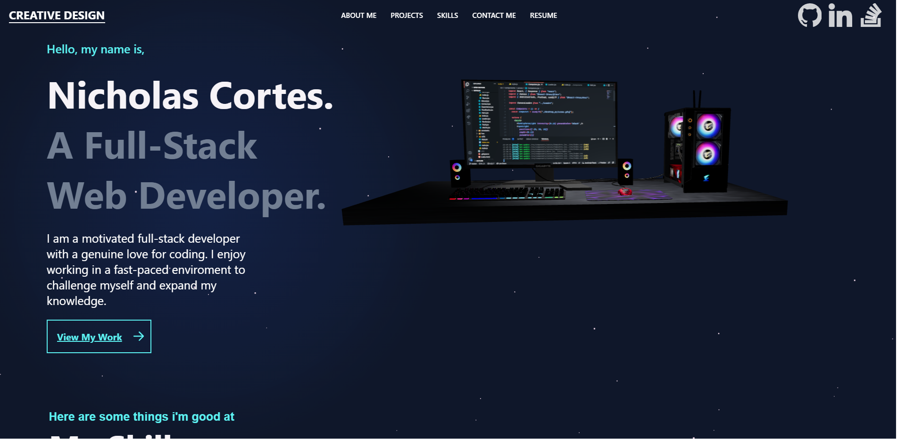
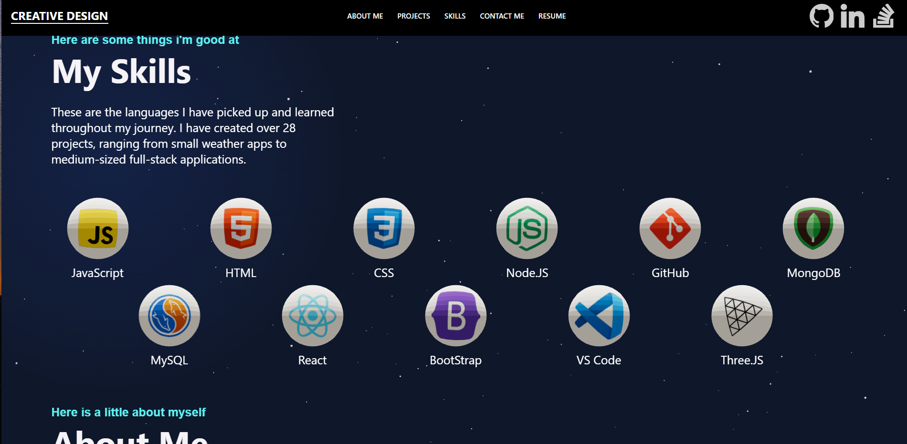
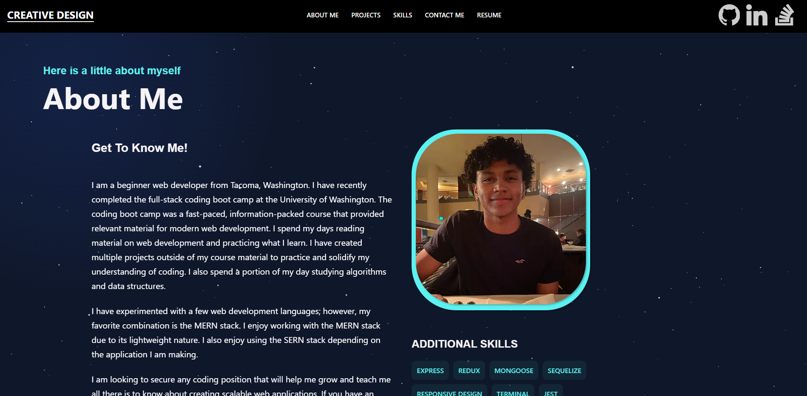
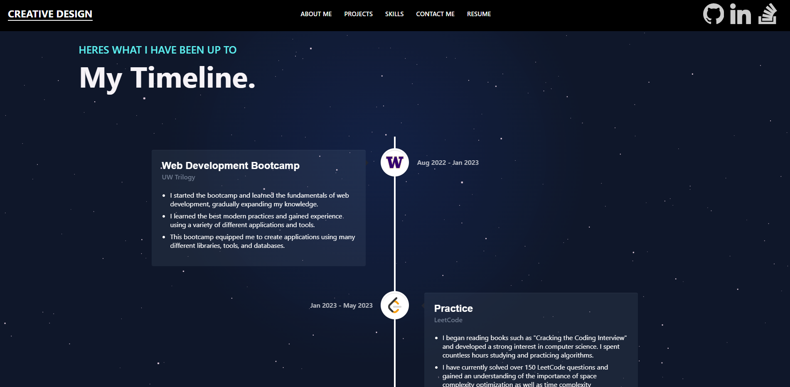
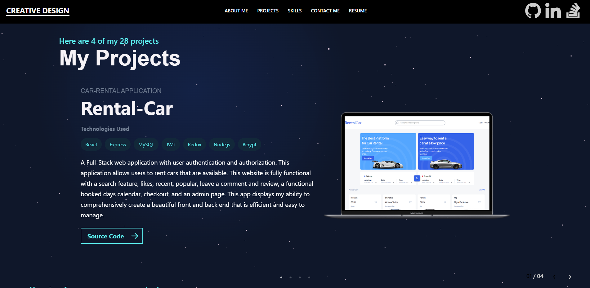
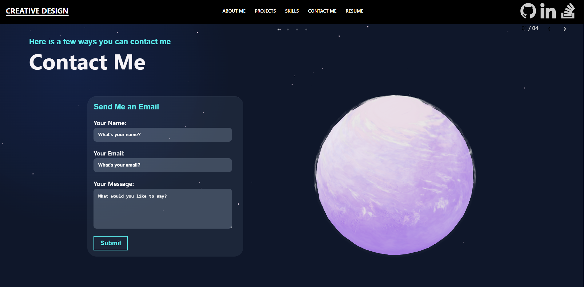

# My Portfolio

Welcome to my portfolio repository! This portfolio showcases my projects, skills, and experience as a Full-Stack web developer
## Technologies Used

- HTML
- CSS
- JavaScript
- React
- Three.JS

## Projects

In this portfolio, you will find the following projects:

- :racing_car: **[Rental Car]**: A full-stack website that offers a convenient platform for renting cars. - [Source Code](https://github.com/ncortes04/car-rental).

- :shopping: **[Shop-Pay]** A full-stack website that offers a platform for purchasing various attie cars. - [Source Code](https://github.com/ncortes04/shop-pay).

- :newspaper: **[Techy]**: A full stack tech blog application, that allows users to interact and discuss about coding. - [Source Code](https://github.com/ncortes04/tech-blog).

## Features

- Responsive Design: The portfolio is designed to be responsive, ensuring optimal viewing experience across different devices.

- Interactive Elements: Incorporates interactive elements such as hover effects, animations, and sliders.

- Project Showcase: Showcases projects with project cards, providing project details and links to view more information and source code.

- Skills Display: Displays the skills and technologies the developer has worked with.

- Contact Form: Includes a contact form to allow visitors to get in touch directly from the portfolio website.

- 3D Models with Three.js: Incorporates 3D models created with Three.js, bringing interactive and immersive elements to the portfolio.

## Screenshots

### Figure 1: Landing

*Description: The landing section of the portfolio showcasing an attractive 3D image and brief introduction.*

### Figure 2: Skills

*Description: The skills section of the portfolio displaying a visual representation of my developer's skills and technologies.*

### Figure 3: About

*Description: The about section of the portfolio providing details about my background, experience, and interests.*

### Figure 4: Timeline

*Description: The timeline section of the portfolio showcasing my education, work experience, and other significant milestones.*

### Figure 5: Projects

*Description: The projects section of the portfolio featuring a collection of my project cards with project names, descriptions, and links.*

### Figure 6: Contact

*Description: The contact section of the portfolio with a contact form for visitors to connect me.*

## Feedback and Contact

I would appreciate any feedback or inquiries. Feel free to reach out to me via 

- Email: cortesnicholas04@gmail.com

- LinkedIn: https://www.linkedin.com/in/nicholas-cortes-9912b2269/

Feel free to connect with me, and let's discuss exciting opportunities or ideas!

Thank you for visiting my portfolio!

